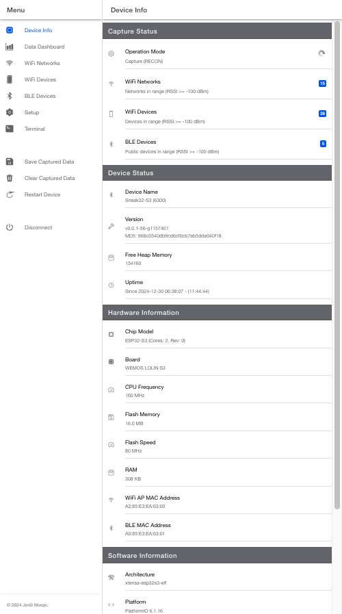

# Sneak32 - ESP32-based WiFi & BLE Scanner and Detector

[](https://opensource.org/licenses/MIT)
[](https://github.com/jordi-murgo/Sneak32/releases)
[](https://github.com/jordi-murgo/Sneak32)

## 📚 Table of Contents

- [Overview](#-overview)
- [Application in Infiltrator Detection](#-application-in-infiltrator-detection)
- [Modes of Operation](#-modes-of-operation)
  - [Core Operation Phases](#core-operation-phases)
  - [Stealth Mode](#stealth-mode)
  - [Mode Selection Guide](#mode-selection-guide)
- [Features](#-features)
- [Hardware](#-hardware)
  - [Compatibility](#compatibility)
  - [Requirements](#requirements)
  - [Antenna Considerations](#antenna-considerations)
- [Software Dependencies](#-software-dependencies)
- [Setup and Configuration](#-setup-and-configuration)
- [Data Output](#-data-output)
- [Usage Strategies](#️-usage-strategies)
- [Security Considerations](#-security-considerations)
- [Future Improvements](#-future-improvements)
- [Contributing](#-contributing)
- [License](#-license)
- [Author](#-author)
- [Version History](#-version-history)
- [Contact and Support](#-contact-and-support)

## 🥷 Overview

Sneak32 is an advanced WiFi and Bluetooth Low Energy (BLE) scanning and detection tool built on the ESP32 platform. It offers powerful capabilities for network analysis, device tracking, and security research.

## 🎯 Application in Infiltrator Detection

Sneak32 is ideal for detecting devices that may be associated with surveillance or infiltration in social movements or sensitive environments. The tool allows you to capture WiFi and BLE device data in one location (RECON phase) and then analyze connections in your secure space (DEFENSE phase) to identify suspicious presences.

## 🔍 Modes of Operation

### Core Operation Phases

#### 1. RECON Phase
- **Purpose:** Capture and collect data in potentially hostile or unsecured environments
- **Capabilities:**
  - Captures WiFi data:
    - SSIDs from Beacons and Probe Requests
    - Client MAC addresses
    - Management, control, and data frames
  - Captures BLE device advertisements
- **Scanning Modes:**
  - **Passive Scan:** 
    - WiFi: Only listens for beacons and probe requests
    - BLE: Only listens for advertisements
    - No active requests sent
  - **Active Scan:**
    - WiFi: Sends probe requests to discover hidden networks
    - BLE: Performs active scanning
    - Maximizes data collection but increases visibility
  - **Stealth Mode:** 
    - Complete radio silence except for essential operations
    - No response to BLE scans (except last paired device)
    - Minimal RF footprint for maximum concealment

#### 2. DEFENSE Phase
- **Purpose:** Monitor secure spaces for previously identified suspicious devices
- **Capabilities:**
  - Monitors for specific WiFi/BLE MAC addresses
  - Detects devices based on their WiFi probe requests
  - Can force device visibility through SSID broadcasting
- **Operation Modes:**
  - **Passive Defense:**
    - Silent monitoring of all communications
    - No active scanning or broadcasting
    - Pure listening mode for maximum stealth
  - **Active Defense:**
    - Broadcasts known suspicious SSIDs to trigger auto-connect attempts
    - Performs active BLE scanning to detect target devices
    - Forces suspicious devices to reveal themselves
  - **Stealth Mode:**
    - Complete radio silence except for essential operations
    - No response to BLE scans (except last paired device)
    - Pure passive monitoring

### Mode Selection Guide

Choose your operation mode based on:
1. **Mission Phase:**
   - RECON: For initial data gathering in hostile environments
   - DEFENSE: For monitoring secure spaces
   
2. **Stealth Requirements:**
   - **Stealth Mode:** When absolute concealment is critical
     - No BLE responses (except to last paired device)
     - Minimal RF emissions
     - Maximum concealment
   
3. **Scanning Intensity:**
   - **Passive:** When stealth is important but full radio silence isn't required
     - No active requests
     - Only listens for broadcasts
   - **Active:** When maximum data collection is priority
     - Sends probe/scan requests
     - Broadcasts known SSIDs (in DEFENSE)
     - Higher chance of detection

4. **Risk vs Data Collection:**
   - Higher scanning intensity = More data but increased detection risk
   - Lower scanning intensity = Less data but better concealment

## 🚀 Features

- **WiFi Capabilities:**
  - Passive monitoring of networks and devices
  - Active scanning with probe requests (in Active mode)
  - Management, control, and data frame capture
  - SSID broadcasting for target device detection (in Active DEFENSE)
  - MAC address filtering and classification

- **BLE Capabilities:**
  - Passive advertisement monitoring
  - Active scanning (configurable)
  - Selective scan response (Stealth mode: only to last paired device)
  - Public/Random address classification
  - RSSI-based proximity detection

- **Customizable Settings:**
  - Independent WiFi/BLE scan intervals
  - RSSI threshold filtering
  - Operation mode selection
  - Target device/network lists
  - Auto-configuration options

- **Data Management:**
  - JSON-formatted output
  - Configurable data filtering
  - Flash storage with persistence
  - Adjustable save intervals
  - Data export capabilities

- **User Interface:**
  - Web-based configuration panel
  - Real-time status monitoring
  - Device control interface
  - Event logging system
  - BLE-based secure communication

## 💻 Hardware

### Compatibility
Sneak32 has been extensively tested with the **ESP32-C3** board, a low-cost RISC-V microcontroller (less than $3), which offers:
- WiFi 802.11 b/g/n (2.4 GHz) and Bluetooth 5.0 LE
- 4MB Flash memory and 400KB SRAM
- 80 MHz (Low Power) and 160 MHz (High Performance) CPU clock

**Board Compatibility:**
- ✅ ESP32 (WROOM-32*/MINI-1/PICO-D4): Full support
- ✅ ESP32-S3: Full support (recommended for high performance & data capacity)
- ✅ ESP32-C3: Full support (recommended for low power consumption)
- ❌ ESP32-S2: Not supported (no BLE)
- ❌ ESP32-H2: Not supported (no WiFi)
- ❌ ESP32-C6: Not supported (no Arduino-PlatformIO framework support yet)

### Requirements
- ESP32 development board (recommended: ESP32-C3-SuperMini or variants with PCB/external antenna)
- (Optional) RGB LED for visual status indication
- (Optional) Battery for portable operation

### Antenna Considerations
Choose based on your specific needs:

1. **Ceramic Chip Antenna (ESP32-C3-SuperMini):**
   - ✅ Compact and low cost
   - ✅ Good for close-range monitoring
   - ❌ Limited range and capture capabilities

2. **PCB Antenna:**
   - ✅ Better range than ceramic
   - ✅ Still relatively compact
   - ❌ Not as powerful as external antenna

3. **External Antenna:**
   - ✅ Best range and data capture
   - ✅ Ideal for wide-area monitoring
   - ❌ Larger form factor
   - ❌ Additional components needed

## 📚 Software Dependencies

- [PlatformIO](https://platformio.org/)
- [Arduino core for ESP32](https://github.com/espressif/arduino-esp32)
- [ESP32 BLE library](https://github.com/nkolban/ESP32_BLE_Arduino)
- [WiFi library](https://github.com/espressif/arduino-esp32/tree/master/libraries/WiFi)
- [FreeRTOS](https://www.freertos.org/)
- (Optional) [Adafruit NeoPixel library](https://github.com/adafruit/Adafruit_NeoPixel)

## 🔧 Setup and Configuration

1. **Clone the repository:**

   ```bash
   git clone https://github.com/jordi-murgo/Sneak32.git
   cd Sneak32
   ```

2. **Install necessary dependencies:**

   - First install [PlatformIO CLI](https://platformio.org/install/cli) or [PlatformIO VSCode Extension](https://platformio.org/install/ide?install=vscode)

   ```bash
   pio lib install
   ```

3. **Compile and flash** the firmware to your ESP32 device:

   With PlatformIO:

   ```bash
   pio run -t upload
   ```

   Or selecting environment and serial port:

   ```bash
   pio run -e esp32-c3-supermini --upload-port /dev/cu.usbmodem101 -t upload
   ```

   With PlatformIO Visual Studio Code Extension, use the "Upload" button.

4. **Power on the device** and verify that the LED (if connected) indicates the correct status.

5. **Connect to the device via Bluetooth LE:**

   

   - Use the Sneak32 Manager present in [docs directory](docs/index.html) or the deployed [Sneak32 Manager](https://jordi-murgo.github.io/Sneak32/)
   - Click "Search for Device" and select your Sneak32 device.

6. **Configure device options** through the interface:
   - Device name
   - Operation mode
   - Scan intervals and durations
   - Thresholds and filters

7. **Start scanning** and monitoring using the interface options.

## 📊 Data Output

Sneak32 provides detailed JSON output including:

- **Detected WiFi networks:**
  - SSIDs, channels, signal strength, network type, times seen, last seen time.

- **WiFi devices:**
  - MAC addresses, signal strength, channel, times seen, last seen time.

- **BLE devices:**
  - Names (if available), MAC addresses, public/private status, signal strength, times seen, last seen time.

- **Example format:**

```json
{
  "wifi_networks": [
    {
      "ssid": "MyWiFiNetwork",
      "rssi": -45,
      "channel": 6,
      "type": "beacon",
      "times_seen": 5,
      "last_seen": 1627845600
    }
  ],
  "wifi_devices": [
    {
      "mac_address": "A4:B1:C1:D1:E1:F1",
      "rssi": -50,
      "channel": 6,
      "times_seen": 10,
      "last_seen": 1627845620
    }
  ],
  "ble_devices": [
    {
      "name": "MyBLEDevice",
      "address": "00:1A:7D:DA:71:13",
      "is_public": true,
      "rssi": -60,
      "times_seen": 3,
      "last_seen": 1627845640
    }
  ]
}
```

## ⚔️ Usage Strategies

- **Public Environment Monitoring**: Install Sneak32 in public meeting places to capture data from unknown devices and analyze connection patterns.
- **Social Movement Protection**: Use Sneak32 to detect devices attempting to connect to known networks or making suspicious probe requests, helping to identify potential infiltrators.
- **Research Applications**: Sneak32 allows security researchers to collect device data without being detected, thanks to its passive mode.

## 🕶 Security Considerations

**Warning:** This project is intended **solely** for educational purposes and authorized network analysis. Unauthorized use of network scanning tools may violate local laws and international regulations.

- **User Responsibility:** The developer is not responsible for misuse of this software.
- **Legal Compliance:** Always ensure you have explicit permission to scan and analyze networks and devices in your environment.
- **Privacy Concerns:** Be aware of privacy laws such as GDPR in the EU or CCPA in California when collecting and processing device data.
- **Ethical Use:** Consider the ethical implications of your actions. Respect individual privacy and obtain consent when necessary.

For more information on legal and ethical considerations in network scanning, please refer to resources such as:

- [NIST Guidelines for Securing Wireless Local Area Networks](https://nvlpubs.nist.gov/nistpubs/Legacy/SP/nistspecialpublication800-153.pdf)
- [OWASP Wireless Security Testing Guide](https://owasp.org/www-project-wstg/)

## 📅 Version History

- **v0.0.1** (2023-10-01): Initial release.

## 📧 Contact and Support

If you have questions or need assistance, feel free to open an [issue](https://github.com/jordi-murgo/Sneak32/issues) in the repository or contact the author directly.

---

*Note:* Ensure you use this tool ethically and legally, respecting the privacy and ownership of networks and devices in your environment.

## 🚀 Future Improvements

We are constantly working to enhance Sneak32. Here are some planned improvements for future versions:

1. **Performance Optimizations**
   - Improve scanning efficiency to reduce power consumption

2. **Extended Storage Capabilities**
   - Add support for external memory cards to increase storage capacity
   - Implement data management features for handling larger datasets

3. **Hardware Compatibility**
   - Verify and ensure compatibility with other ESP32* boards and models like ESP32-C6 (currently not supported by Espressif - PlatformIO - Arduino)
   - Support for LoRa32 boards
     - [LILYGO ® TTGO LoRa32](https://www.aliexpress.us/item/32872078587.html)
     - [Heltec LoRa32 ESP32 SX1262 LoRa](https://www.aliexpress.us/item/3256806616057872.html)
   - Support for other communication boards ([NRF24L01](https://es.aliexpress.com/item/4000603343837.html))

4. **Communications**
   - Stealth communications using ESP-Now, NRF24L01, ZigBee and LoRa
   - Make a BLE Server proxy to LoRa (or LoRaWAN), NRF24L01, ZigBee, and ESP-Now.

We welcome contributions and suggestions from the community to help make these improvements a reality. If you have ideas or want to contribute, please check our [Contributing](#-contributing) section below.

## 📝 License

This project is licensed under the MIT License - see the [LICENSE](LICENSE) file for details.

## 🤝 Contributing

Contributions are welcome! Please feel free to submit a Pull Request or open an [issue](https://github.com/jordi-murgo/Sneak32/issues) with your ideas and suggestions.

## 👤 Author

**Jordi Murgo** - [@jordi-murgo](https://github.com/jordi-murgo)

Feel free to contact me for any questions or feedback.
