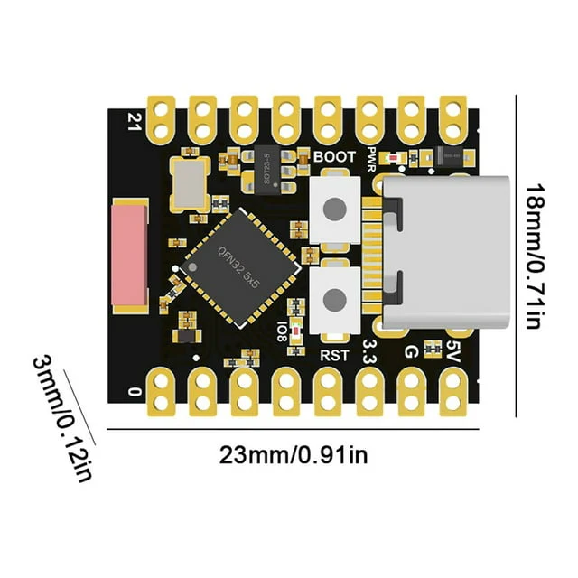

# Sneak32 - ESP32-based WiFi & BLE Scanner and Detector

[](https://opensource.org/licenses/MIT)
[](https://github.com/jordi-murgo/Sneak32/releases)
[](https://github.com/jordi-murgo/Sneak32)

## 📚 Table of Contents

- [Overview](#-overview)
- [Application in Infiltrator Detection](#-application-in-infiltrator-detection)
- [Operation Modes](#-operation-modes)
- [Features](#-features)
- [Hardware and Software Compatibility](#-hardware-and-software-compatibility)
- [Hardware Requirements](#-hardware-requirements)
- [Software Dependencies](#-software-dependencies)
- [Setup and Configuration](#-setup-and-configuration)
- [Data Output](#-data-output)
- [Usage Strategies in Sensitive Environments](#️-usage-strategies-in-sensitive-environments)
- [Operating Modes](#️-operating-modes)
- [Security Considerations](#-security-considerations)
- [Contributing](#-contributing)
- [License](#-license)
- [Author](#-author)
- [Version History](#-version-history)
- [Contact and Support](#-contact-and-support)

## 🕵️‍♂️ Overview

Sneak32 is an advanced WiFi and Bluetooth Low Energy (BLE) scanning and detection tool built on the ESP32 platform. It offers powerful capabilities for network analysis, device tracking, and security research.

## 🎯 Application in Infiltrator Detection

Sneak32 is ideal for detecting devices that may be associated with surveillance or infiltration in social movements or sensitive environments. The tool allows you to capture WiFi and BLE device data in one location (RECON phase) and then analyze connections in your secure space (DETECTION phase) to identify suspicious presences.

## 🔍 Operation Modes

- **RECON Phase:**
  - Captures SSIDs (from Beacons and Probe Requests), WiFi client MAC addresses, and BLE device advertisements in hostile or unsecured terrains.
  - Ideal for collecting data without drawing attention (passive and stealth modes).
  - Captures WiFi management, control, and data frames.
  - Configurable to focus on management frames only.
  - BLE scanning can be passive or active depending on the mode.
  - In Stealth mode, the device doesn't advertise itself via BLE until it detects a preconfigured device name in BLE advertisements.

- **DETECTION Phase:**
  - Once data is collected in the RECON phase, Sneak32 can be used in your secure space to monitor for the presence of suspicious devices, identified by their WiFi/BLE MAC addresses or by the SSIDs in their WiFi probe requests.
  - Uses passive scans for discreet monitoring.
  - In active mode, periodically broadcasts all prohibited SSIDs to force visibility of devices that might attempt to connect, even if they haven't emitted a Probe Request.

## 🚀 Features

- **Dual-Mode Operation:**
  - Scan Mode: Continuously scans for WiFi networks, devices, and BLE devices.
  - Detection Mode: Monitors for specific WiFi networks or devices.

- **WiFi Capabilities:**
  - Detects WiFi networks (SSIDs) and connected devices.
  - Captures management, control, and data frames.
  - Configurable to focus on management frames only.
  - Detects WiFi devices based on MAC address.

- **BLE Capabilities:**
  - Scans for nearby BLE devices.
  - Option to ignore random BLE addresses.
  - Detects specific BLE devices.

- **Customizable Settings:**
  - Adjustable scan intervals for WiFi and BLE.
  - Configurable RSSI threshold for signal filtering.
  - Passive scan option.
  - Stealth mode to minimize detectability.
  - Device name configuration based on chip model and MAC address.

- **Data Management:**
  - JSON data output for easy parsing and analysis.
  - Option to save all data or only relevant data.
  - Configurable autosave interval.
  - Flash storage for data persistence.

- **User Interface:**
  - Web-based interface (HTML/JavaScript) for configuration and data retrieval.
  - Real-time status updates.
  - Event logging for monitoring device activities.
  - Bluetooth LE connection with specific characteristics for commands, data transfer, and settings.

## 💻 Hardware and Software Compatibility

Sneak32 has been tested with the **ESP32-C3** board, a low-cost RISC-V microcontroller (less than $3), which offers:

- WiFi 802.11 b/g/n (2.4 GHz) and Bluetooth 5.0 LE.
- 4MB Flash memory and 400KB SRAM.
- Support for **Arduino IDE**, **PlatformIO**, and **Espressif IDF**, facilitating programming and customization of the device according to each project's needs.

## 🖥️ Hardware Requirements

- ESP32 development board (recommended: ESP32-C3-SuperMini or other ESP32 variants with PCB antenna or external antenna)
- (Optional) RGB LED for visual status indication
- (Optional) Battery for portable operation



The ESP32-C3-SuperMini is a good choice for this project due to its compact size, low cost, and low power consumption. However, it's important to note that this model uses a ceramic chip antenna, which may limit its range and data capture capabilities compared to models with PCB antennas or external antennas.

For optimal performance and range:

- Consider ESP32 variants with PCB antennas or external antenna connectors.
- Models with external antennas generally offer the best range and data capture capabilities.

Other ESP32 variants are compatible with the program by specifying the appropriate board in the `platformio.ini` file.

### Antenna Considerations

1. **Ceramic Chip Antenna (e.g., ESP32-C3-SuperMini):**
   - Pros: Compact, low cost
   - Cons: Limited range, may capture fewer data points

2. **PCB Antenna:**
   - Pros: Better range than ceramic chip antennas, still relatively compact
   - Cons: May not match the range of external antennas

3. **External Antenna:**
   - Pros: Best range and data capture capabilities
   - Cons: Larger form factor, may require additional components

Choose the antenna type based on your specific needs for range, data capture, and form factor.

## 📚 Software Dependencies

- [PlatformIO](https://platformio.org/)
- [Arduino core for ESP32](https://github.com/espressif/arduino-esp32)
- [ESP32 BLE library](https://github.com/nkolban/ESP32_BLE_Arduino)
- [WiFi library](https://github.com/espressif/arduino-esp32/tree/master/libraries/WiFi)
- [FreeRTOS](https://www.freertos.org/)
- (Optional) [Adafruit NeoPixel library](https://github.com/adafruit/Adafruit_NeoPixel)

## 🔧 Setup and Configuration

1. **Clone the repository:**

  ```bash
  git clone https://github.com/jordi-murgo/Sneak32.git
  cd Sneak32
  ```

2. **Install necessary dependencies:**

   If using PlatformIO:

   ```bash
   pio lib install
   ```

   If using Arduino IDE, install the libraries through the Library Manager.

3. **Compile and flash** the firmware to your ESP32 device:

   With PlatformIO:

    ```bash
    pio run -t upload
    ```

    Or selecting environment and serial port:

    ```bash
    pio run -e esp32-c3-supermini --upload-port /dev/cu.usbmodem101 -t upload
    ```

   With PlatfotmIO Visual Studio Code Extension, use the "Upload" button.

4. **Power on the device** and verify that the LED (if connected) indicates the correct status.

5. **Connect to the device via Bluetooth LE:**

   

   - Use the Smeak32 Manager present in [docs directory](docs/index.html) or the deployed [Sneak32 Manager](https://jordi-murgo.github.io/Sneak32/)
   - Click "Search for Device" and select your Sneak32 device.

6. **Configure device options** through the interface:
   - Device name
   - Operation mode
   - Scan intervals and durations
   - Thresholds and filters

7. **Start scanning** and monitoring using the interface options.

## 📊 Data Output

Sneak32 provides detailed JSON output including:

- **Detected WiFi networks:**
  - SSIDs, channels, signal strength, network type, times seen, last seen time.

- **WiFi devices:**
  - MAC addresses, signal strength, channel, times seen, last seen time.

- **BLE devices:**
  - Names (if available), MAC addresses, public/private status, signal strength, times seen, last seen time.

- **Example format:**

```json
  {
    "wifi_networks": [
      {
        "ssid": "MyWiFiNetwork",
        "rssi": -45,
        "channel": 6,
        "type": "beacon",
        "times_seen": 5,
        "last_seen": 1627845600
      }
    ],
    "wifi_devices": [
      {
        "mac_address": "A4:B1:C1:D1:E1:F1",
        "rssi": -50,
        "channel": 6,
        "times_seen": 10,
        "last_seen": 1627845620
      }
    ],
    "ble_devices": [
      {
        "name": "MyBLEDevice",
        "address": "00:1A:7D:DA:71:13",
        "is_public": true,
        "rssi": -60,
        "times_seen": 3,
        "last_seen": 1627845640
      }
    ]
  }
  ```

## ⚔️ Usage Strategies in Sensitive Environments

- **Public Environment Monitoring**: Install Sneak32 in public meeting places to capture data from unknown devices and analyze connection patterns.
- **Social Movement Protection**: Use Sneak32 to detect devices attempting to connect to known networks or making suspicious probe requests, helping to identify potential infiltrators.
- **Research Applications**: Sneak32 allows security researchers to collect device data without being detected, thanks to its passive mode.

## 🕶️ Operating Modes

- **Passive Mode**: Does not perform active scans or announce networks, simply listens to communications without being detected.
- **Active Mode**: Announces fake networks (SSIDs) to entice devices to connect, or performs "active scans" to obtain information from nearby BLE devices.

## 🔐 Security Considerations

**Warning:** This project is intended **solely** for educational purposes and authorized network analysis. Unauthorized use of network scanning tools may violate local laws and international regulations.

- **User Responsibility:** The developer is not responsible for misuse of this software.
- **Legal Compliance:** Always ensure you have explicit permission to scan and analyze networks and devices in your environment.
- **Privacy Concerns:** Be aware of privacy laws such as GDPR in the EU or CCPA in California when collecting and processing device data.
- **Ethical Use:** Consider the ethical implications of your actions. Respect individual privacy and obtain consent when necessary.

For more information on legal and ethical considerations in network scanning, refer to resources such as:

- [NIST Guidelines for Securing Wireless Local Area Networks](https://nvlpubs.nist.gov/nistpubs/Legacy/SP/nistspecialpublication800-153.pdf)
- [OWASP Wireless Security Testing Guide](https://owasp.org/www-project-wstg/)

## 📅 Version History

- **v0.0.1** (2024-10-01): Initial release.

## 📧 Contact and Support

If you have questions or need assistance, feel free to open an **issue** in the repository or contact the author directly.

---

*Note:* Ensure you use this tool ethically and legally, respecting the privacy and ownership of networks and devices in your environment.

## 🚀 Future Improvements

We are constantly working to enhance Sneak32. Here are some planned improvements for future versions:

1. **Performance Optimizations**
   - Improve scanning efficiency to reduce power consumption

2. **Extended Storage Capabilities**
   - Add support for external memory cards to increase storage capacity
   - Implement data management features for handling larger datasets

3. **Hardware Compatibility**
   - Verify and ensure compatibility with other ESP32* boards and models like ESP32-C6 (currently not supported by Espressif - Platform.IO - Arduino)
   - Support for LoRa32 boards
     - [LILYGO ® TTGO LoRa32](https://www.aliexpress.us/item/32872078587.html)
     - [Heltec LoRa32 ESP32 SX1262 LoRa](https://www.aliexpress.us/item/3256806616057872.html)
   - Support for othr communication boards ([NRF24L01](https://es.aliexpress.com/item/4000603343837.html))

4. **Communications**
   - Stealth communications using ESP-Now, NRF24L01, ZigBee and LoRa
   - Make a BLE Server proxy to LoRa (or LoRaWAN), NRF24L01, ZigBee, and ESP-Now.

We welcome contributions and suggestions from the community to help make these improvements a reality. If you have ideas or want to contribute, please check our [Contributing](#-contributing) section.

## 📝 License

This project is licensed under the MIT License - see the [LICENSE](LICENSE) file for details.

## 🤝 Contributing

Contributions are welcome!
## 👤 Author

**Your Name** - [@jordi-murgo](https://github.com/jordi-murgo)

Feel free to contact me for any questions or feedback.
